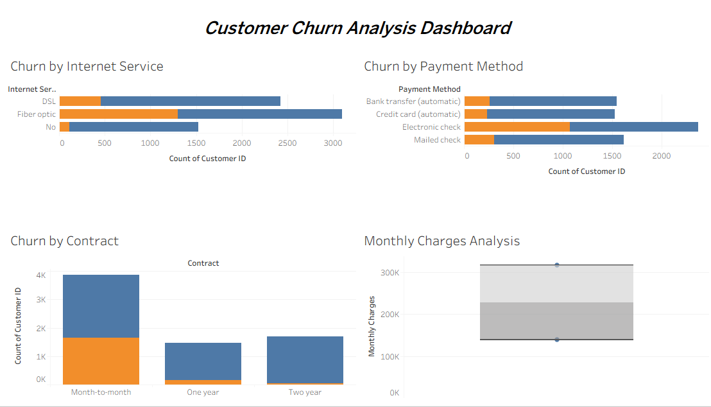

# Customer Churn Analysis

## Project Overview

This project analyzes customer churn data from a telecom company using Python, Machine Learning, and Tableau.

The objective is to identify factors contributing to customer churn and provide actionable business insights to improve customer retention.

## Technologies Used

- Python
- Pandas
- Scikit-Learn
- Tableau
- CSV

## Machine Learning Model

**Model:** Random Forest Classifier

**Accuracy Achieved:** 79.77%

## Key Business Insights

- Customers with Month-to-Month contracts have the highest churn rate.
- Fiber Optic users show higher churn compared to DSL users.
- Electronic Check customers are more likely to churn.
- Contract type significantly impacts customer retention.

## Dashboard



## Project Structure

```text
Customer-Churn-Analysis
├── data
├── python
├── screenshots
├── tableau
└── README.md
```

## Future Improvements

- Hyperparameter tuning for improved model performance.
- Deployment using Streamlit.
- Customer churn prediction web application.

## Author

**Krutika Koli**
